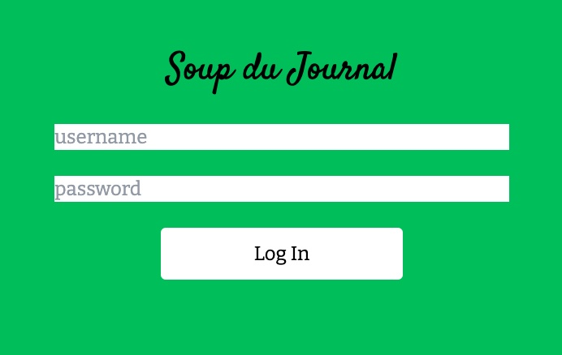
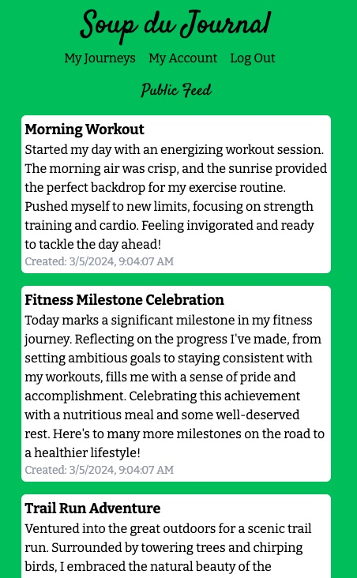
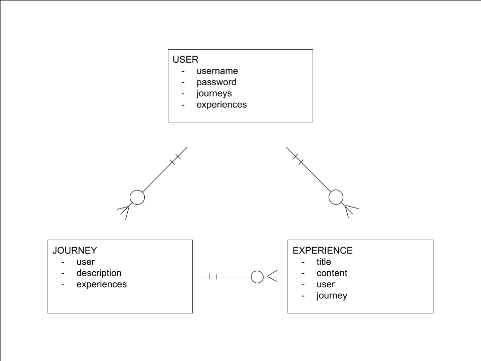
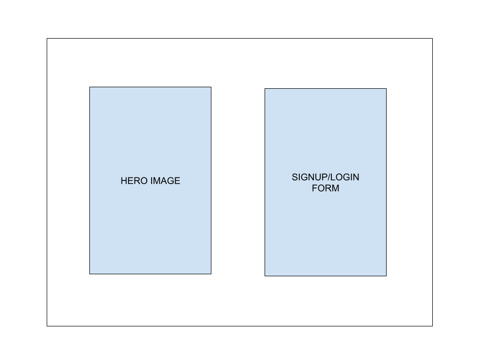
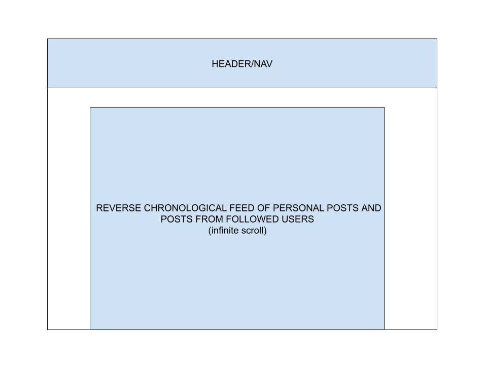
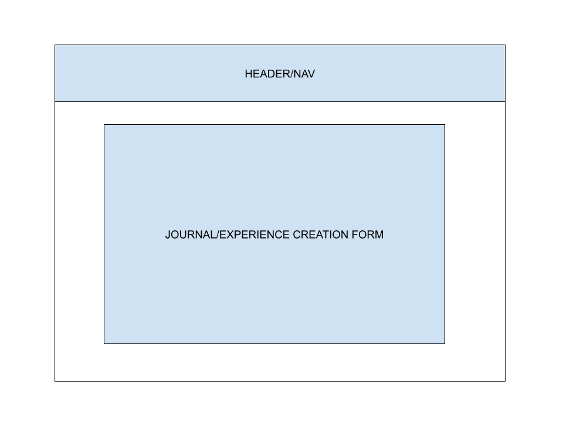
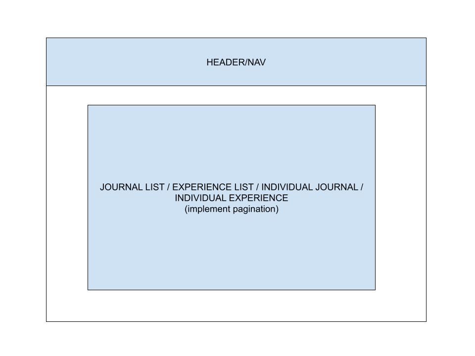

# Soup Du Journal 🍜
[View deployed site here](https://soup-du-journal-eebf0083428a.herokuapp.com/)
## Technologies Used
Vite/React, JSX, Express, Mongoose, Node

## Highlights
### Landing Page - Mobile

### Landing Page - PC

### Login

### Dashboard

    
Planning Resources

    <h1>User Stories</h1>
    <ul>
        <li>As a user, I want to create journals and entries for my journals.</li>
        <li>As a user, I want all my journaling to be accessible from my PC or phone.</li>
        <li>As a user, I want to organize journal entries by broader categories of my own choosing.</li>
        <li>As a user, I want to view other people's journal entries.</li>
    </ul>
    <h1>ERD</h1>
    
    <h1>Wireframes</h1>
    <h3>Signup/Login</h3>
    
    <h3>User Dashboard</h3>
    
    <h3>Create Journal or Experience</h3>
    
    <h3>Show Journal or Experience</h3>
    

    
Project Status

    <h2>Unsolved Problems and Development Hurdles</h2>
    <ul>
        <li>Need to implement conditionally rendered edit/create/delete buttons/routes</li>
    </ul>
    <h2>Next Steps</h2>
    <ul>
        </li>Implement FTP to allow users to upload photos</li>
        </li>Implement keyword search feature</li>
    </ul>

## Installation Instructions
<ol>
    <li>Clone repo and run the following in root folder to install project dependencies<pre>npm i</pre></li>
    <li>Create MongoDB account and add connection string to environment variables</li>
    <li>Create secret key for JWTs in environment variables</li>
</ol>

## Route Tables
### Server Side CRUD Routes
| **HTTP Method** | **URL** | **CRUD Action** | **Description** |
| --- | --- | --- | --- |
| **Users** |
| GET | /users/account | READ | Show user account info |
| POST | /users/signup | CREATE | Create new user account |
| POST | /users/login | READ | Authenticate login credentials |
| PUT | /users | UPDATE | Edit user account info |
| DELETE | /users | DELETE | Delete user account |
| **Journeys** |
| GET | /journeys | READ | Index journeys per user |
| GET | /journeys/:journey | READ | Show journey |
| POST | /journeys| CREATE | Create journey |
| PUT | /journeys/:journey | UPDATE | Edit journey |
| DELETE | /journeys/:journey | DELETE | Delete journey |
| **Experiences** |
| GET | /experiences | READ | Index experiences for public feed |
| GET | /experiences/:journey/journeyexperiences | READ | Index experiences per journey |
| GET | /experiences/:experience | READ | Show experience |
| POST | /experiences/:journey | CREATE | Create experience |
| PUT | /experiences/:experience | UPDATE | Edit experience |
| DELETE | /experiences/:experience | DELETE | Delete existing experience |

### Client Side Routes
| **HTTP Method** | **URL** | **CRUD Action** | **Description** |
| --- | --- | --- | --- |
| GET | / | READ | Present buttons for signup/login forms |
| GET | /auth/:authType | READ | Present signup or login form |
| GET | /account | READ | Show account info |
| GET | /account/edit | READ | Present edit account form |
| GET | /dashboard | READ | Index experiences for public feed |
| GET | /createexperience/:journeyId | READ | Present create experience form |
| GET | /experience/:experienceId | READ | Show experience |
| GET | /experience/:experienceId/edit | READ | Present edit experience form |
| GET | /journeys | READ | Index user journeys |
| GET | /createjourney | READ | Present create journey form |
| GET | /journey/:journeyId | READ | Show journey |
| GET | /journey/:journeyId/edit | READ | Present edit journey form |